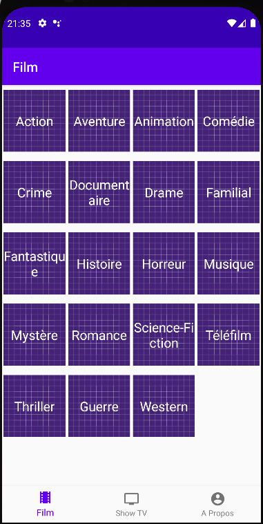
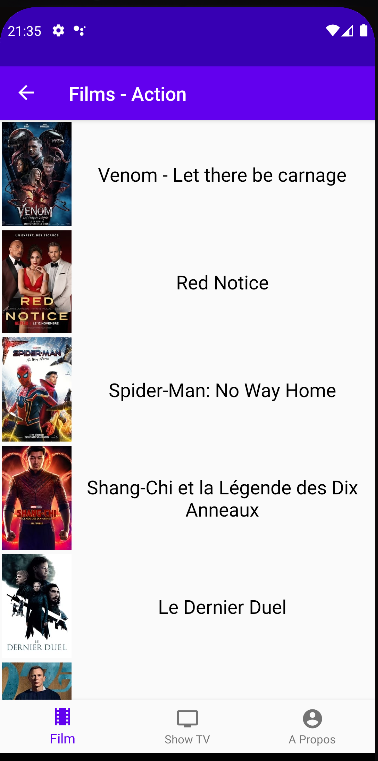
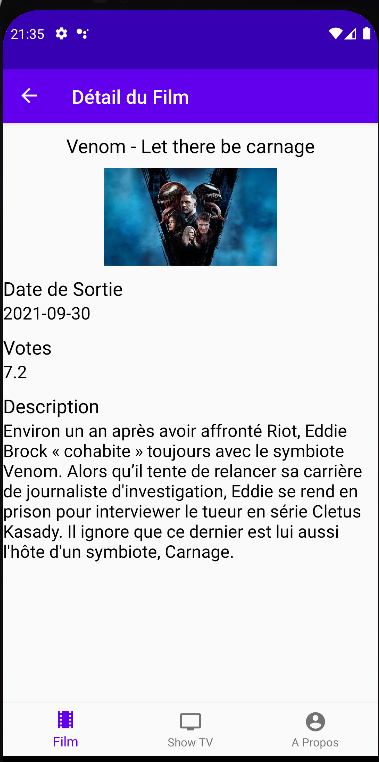
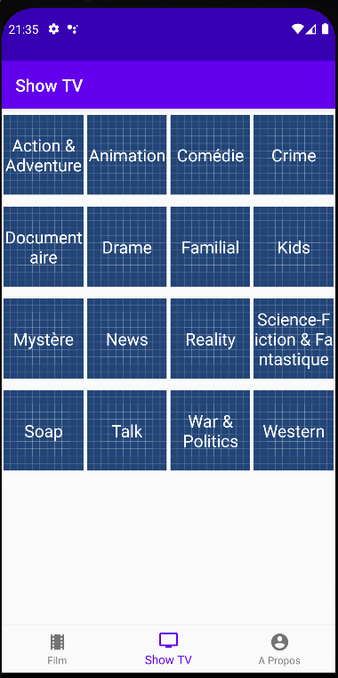
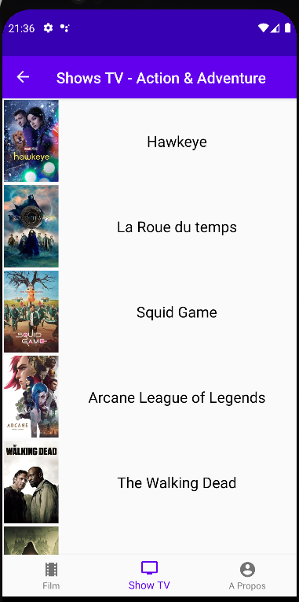
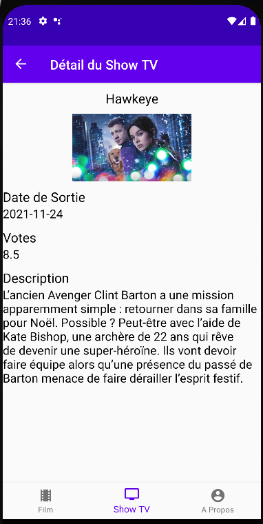
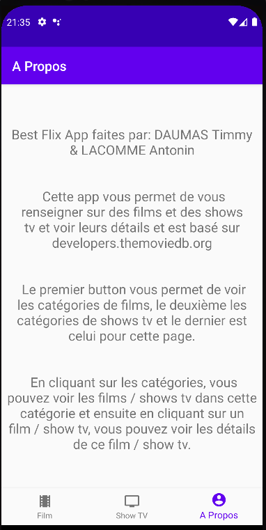

# BestFlix

## Equipe
Ce projet a été réalisé par des élèves de Master 2 MIAGE de Sophia Antipolis, option MBDS.

Membre du projet:
- Timmy DAUMAS
- Antonin LACOMME

## Projet
Ce projet est un projet Android réalisé en Kotlin à l'aide d'Android Studio.

La majorité s'est faites sur Discord à l'aide du Live Coding et de partage d'écran.

Il y a également eu des rassemblement à la faculté afin de discuter des points les plus important du projet.

Il s'agit d'une application permettant de consulter les détails de films et de séries TV
basé sur la base de données de themoviedb.org.

## Fonctionnalités
### Films
#### Catégories de Films

#### Films dans une Catégorie

#### Détails d'un Film

### Séries TV
#### Catégories de Séries TV

#### Séries TV dans une Catégorie

#### Détails d'une Série TV

### A Propos

## Rendu
- Date limite : 14 Décembre 2021 (avant minuit)
- Modalités de rendu : Remplir le drive qui vous sera envoyé par mail
- Ajouté un fichier readme dans lequel vous décrirez
    - Le contexte du projet et ses différentes fonctionnalités
    - La liste des membres du groupe
    - Captures d'écrans des principales vues
    - Vidéos de démonstration de l'application

